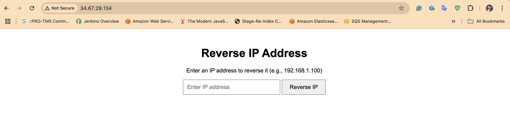

# Reverse IP Web Application

This is a Python-based web application that takes an IP address as input, performs a reverse IP lookup, and returns the reversed IP.

**Example:**

- **Input:** `10.5.100.23`
- **Output:** `23.100.5.10`

The web application is deployed using Docker, Kubernetes (GKE), Helm, and CI/CD for end-to-end automation.

---

## Features

- **Reverse IP Lookup:** Input an IP address and get its reverse.
- **Web Interface:** A simple UI for interacting with the app.
- **Dockerized:** The app is containerized using Docker.
- **Helm Chart:** Deploys the app to GKE using Helm for Kubernetes management.
- **CI/CD:** Continuous Integration and Continuous Deployment setup for end-to-end deployment.

---

## Prerequisites

Before starting the deployment process, ensure you have the following:

1. **Python 3.x** installed on your local machine.
2. **Docker** installed to containerize the application.
3. **Kubernetes** cluster set up on Google Cloud (GKE).
4. **Helm** installed for Kubernetes application management.(taking care by CICD)
5. **CI/CD Platform** (e.g., GitHub Actions) for automation.

---

- **Some picture:** 
- 
- 
- 

Access via - http://34.67.29.134/

## Project Structure

```plaintext
.
├── app.py
├── main.py
│  
│   └── templates/
│       └── index.html        # Simple UI template
├── Dockerfile                # Docker configuration
├── helm/
│   └── flask-web-app-chart/  # Helm chart directory
├── k8s/
│   └── manifests/            # Kubernetes manifests for deployment
└── ci-cd/
    └── .github/              # GitHub Actions configuration (CI/CD)


